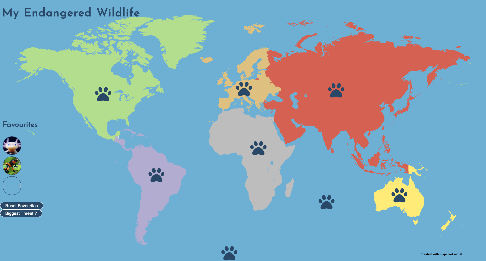
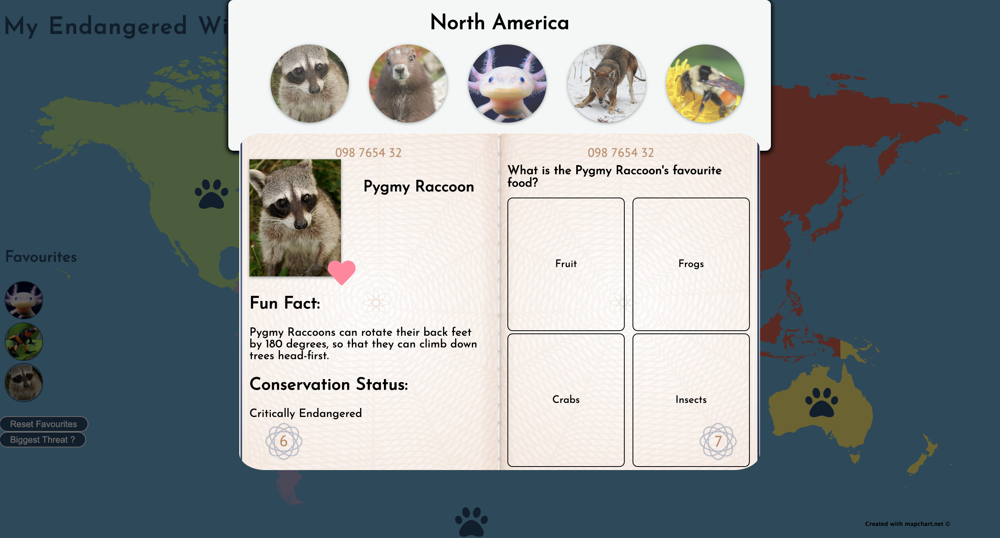

# Endangered
Endangered is an interactive map designed to teach primary school children about endangered animals and the threats to their habitats. Children are able to see examples of endangered animals for each continent, read a bit about each animal and answer a multiple choice quiz question for each animal. They can also favourite animals, and find out what common threat affects their favourites.
This app was made over six days with a team of four using Vue for the frontend, Express for backend with MongoDB for data persistance.

 


## Project Brief
### Educational App
The BBC are looking to improve their online offering of educational content by developing some interactive browser applications that display information in a fun and interesting way. Your task is to make an a Minimum Viable Product or prototype to put forward to them - this may only be for a small set of information, and may only showcase some of the features to be included in the final app.

### MVP
A user should be able to:

- view some educational content on a particular topic
- be able to interact with the page to move through different sections of content

### Example Extensions
- Use an API to bring in content or a database to store information.
- Use charts or maps to display your information to the page.

## Conclusions
### What I've learned
- This was my first opportunity to create a project with a team, and I learned how to better plan as a team and employ an agile methodology, with regular reviews and check-ins.
- The project helped consolidate my knowledge of Vue and CSS, although there is still a lot still to learn about both.

### Things To Improve
- The CSS  didn't scale properly to different screen sizes, so planning for a more responsive CSS would be something to do in the future.
- Better planning of component structures.

### Future Possible Extensions
- Allowing a user to create an 'explorer' profile, that would keep track of their favourite animals and a quiz score.
- Adding more information and helpful links to the 'biggest threat' window.


## Project Set Up
### Backend Set Up

Install dependencies. Within in the server folder:

```
npm install
```

Run mongod to start MongoDB services (leave running in a terminal window).

```
mongod
```

Seed the database.  Within the server folder:

```

npm run seeds
```

Run express (leave running in a terminal window).  Within the server folder:

```
npm run server:dev
```

### Frontend Set Up

Follow these instructions within the client directory:

```
npm install
npm run serve
```

